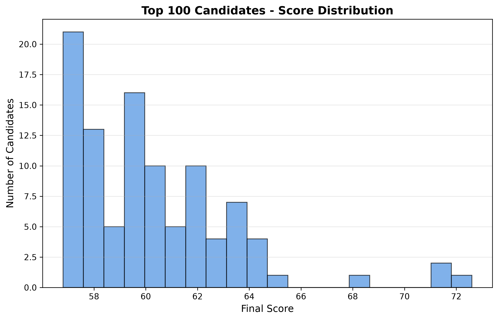
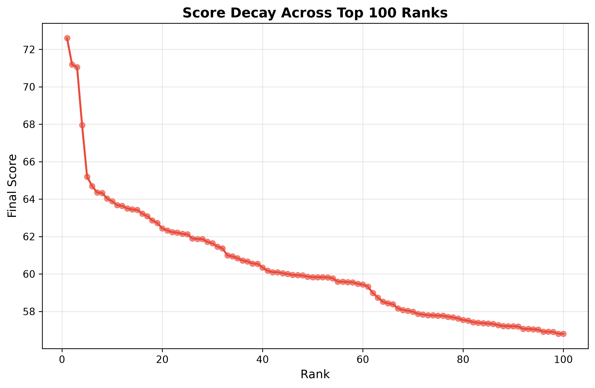
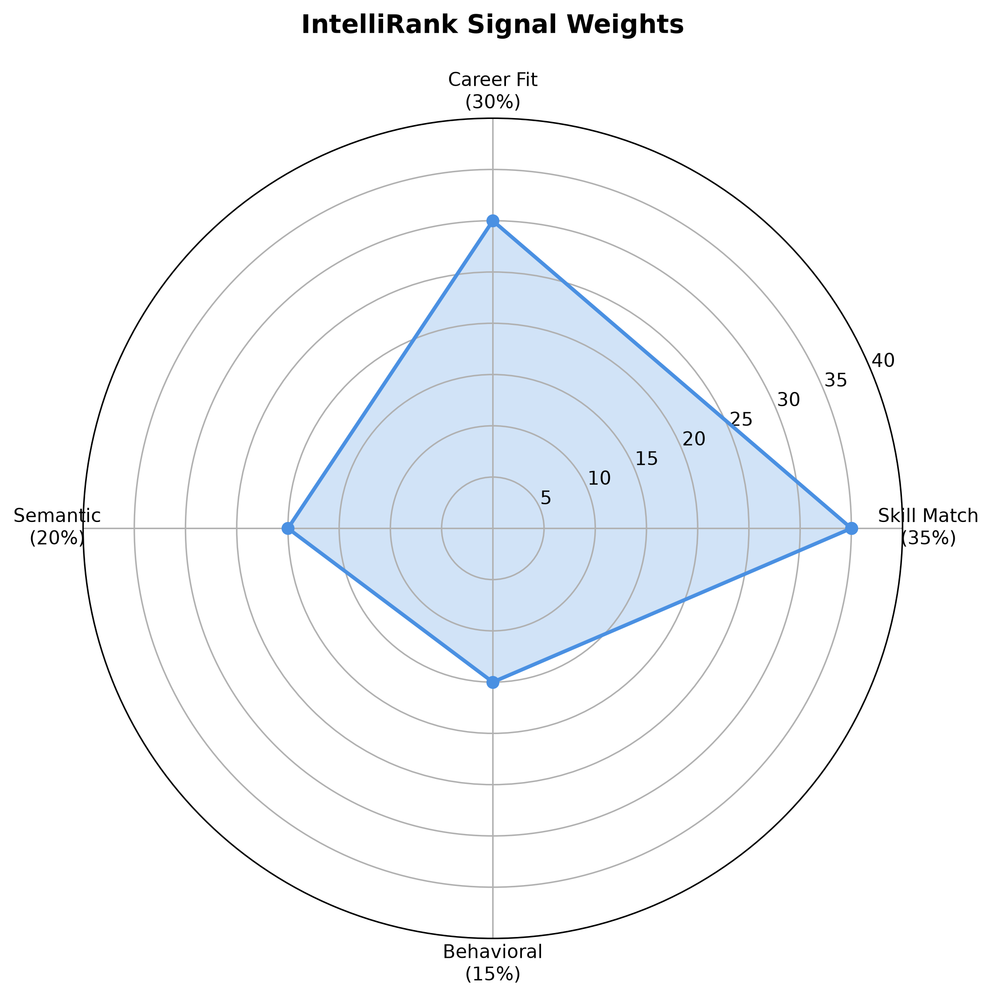

# IntelliRank — AI-Powered Candidate Discovery & Ranking System

<div align="center">

[](https://intellisense-2253d.web.app/)
[](https://github.com/pranayukey200/Redrob-Data-AI-_challenge)
[](LICENSE)

**Redrob Data & AI Challenge: Intelligent Candidate Discovery**

*Ranking 100,000 candidates in 69 seconds with explainable AI*

[🚀 Try Live Demo](https://intellisense-2253d.web.app/) • [📊 View Presentation](output/IntelliRank_Deck_Final.pptx) • [📄 Documentation](#documentation)

</div>

---

## 🎯 The Challenge

Rank **100,000 candidates** for a Senior AI Engineer role at Redrob AI (Series A startup) and produce the **top 100 best-fit candidates** with explainable reasoning.

### Constraints
- ⏱️ **Runtime**: ≤ 5 minutes
- 💾 **Memory**: ≤ 16 GB RAM
- 🚫 **No GPU** allowed
- 🌐 **No network** during ranking
- 📊 **Output**: CSV with reasoning

### Evaluation Metrics
- **NDCG@10** (50%): Quality of top-10 picks
- **NDCG@50** (30%): Quality of top-50 picks
- **MAP** (15%): Mean Average Precision
- **P@10** (5%): Precision at 10

---

## 🏆 Our Solution: IntelliRank

**A multi-signal AI ranking engine** that scores all 100,000 candidates across 4 independent signals and fuses them into a ranked shortlist with per-candidate explanations — in under 69 seconds on CPU.

### Key Performance Metrics

```
⚡ Runtime:      69 seconds  (< 5 min limit)
💾 Memory:       ~4 GB       (< 16 GB limit)
💻 Compute:      CPU only    (no GPU)
🌐 Network:      Offline     (no API calls)
📊 Candidates:   100,000     → Top 100 ranked
✅ Validation:   PASSED
```

---

## 🧠 Architecture Overview

IntelliRank uses a **4-signal weighted fusion** approach:

```
┌─────────────────────────────────────────────────────────────────┐
│                    candidates.jsonl (100K)                      │
└────────────────────────────┬────────────────────────────────────┘
                             │
                             ▼
              ┌──────────────────────────────┐
              │      Data Preprocessing      │
              │  • Parse JSON records        │
              │  • Build TF-IDF matrix       │
              └──────────┬───────────────────┘
                         │
         ┌───────────────┼───────────────┬─────────────┐
         ▼               ▼               ▼             ▼
┌────────────────┐ ┌──────────┐ ┌───────────┐ ┌──────────────┐
│  Skill Match   │ │ Career   │ │ Semantic  │ │ Behavioral   │
│     (35%)      │ │  Fit     │ │   (20%)   │ │    (15%)     │
│                │ │  (30%)   │ │           │ │              │
│ • Cluster      │ │ • Exp    │ │ • TF-IDF  │ │ • Avail-     │
│   coverage     │ │   years  │ │   cosine  │ │   ability    │
│ • Proficiency  │ │ • Title  │ │   sim     │ │ • Response   │
│ • Duration     │ │ • Location│ │ • 50K     │ │ • Reliability│
│ • Endorsements │ │ • Company│ │   bigrams │ │ • Engagement │
└────────┬───────┘ └────┬─────┘ └─────┬─────┘ └──────┬───────┘
         │              │              │               │
         └──────────────┴──────────────┴───────────────┘
                         │
                         ▼
              ┌──────────────────────────────┐
              │     Weighted Fusion          │
              │  Renormalized if signals     │
              │  missing                     │
              └──────────┬───────────────────┘
                         │
                         ▼
              ┌──────────────────────────────┐
              │   Top 100 Ranked Candidates  │
              │   submission.csv             │
              │   + reasoning                │
              └──────────────────────────────┘
```

### Signal Breakdown

| Signal | Weight | What It Measures |
|--------|--------|------------------|
| **🎯 Skill Match** | 35% | Coverage of must-have skill clusters (embeddings, vector DB, Python, ranking eval, NLP/IR) with proficiency × duration × endorsement weighting |
| **💼 Career Fit** | 30% | Experience years (Gaussian around 7yr ideal), title relevance, India location, product vs consulting background, production deployment signals |
| **📊 Semantic** | 20% | TF-IDF cosine similarity between JD query and candidate profile text (50K bigram features, offline) |
| **🔔 Behavioral** | 15% | Platform availability (open_to_work, recency, notice period), responsiveness, reliability, GitHub/engagement |

---

## 📊 Results Visualization

### Score Distribution


### Rank vs Score Decay


### Signal Weights


---

## 🚀 Quick Start

### Prerequisites
- Python 3.11+
- 16 GB RAM (recommended)
- CPU (no GPU required)

### Installation

```bash
# Clone repository
git clone https://github.com/pranayukey200/Redrob-Data-AI-_challenge.git
cd Redrob-Data-AI-_challenge

# Install dependencies
pip install -r requirements.txt
```

### Usage

#### 1. Precompute TF-IDF Index (One-time, ~3-5 min)

```bash
python precompute.py --candidates ./data/raw/candidates.jsonl
```

Saves to `./cache/` (~50 MB). Skip this and pass `--no-semantic` to `rank.py` if you want rule-only scoring.

#### 2. Generate Ranked Submission (< 70 seconds)

```bash
python rank.py --candidates ./data/raw/candidates.jsonl --out ./output/submission.csv
```

#### 3. Validate Submission

```bash
python validate_submission.py ./output/submission.csv
```

Expected output: `Submission is valid.`

---

## 🌐 Web Application

### Live Demo
🔗 **https://intellisense-2253d.web.app/**

Features:
- Interactive ranking interface
- Weight preset selector (Balanced, Senior Hire, IC/Hacker)
- Score breakdown with radar charts
- CSV/XLSX export
- Handles sample datasets (≤100 candidates)

### Run Locally

```bash
# Terminal 1 — Backend
uvicorn api.main:app --port 8000 --reload

# Terminal 2 — Frontend
cd frontend
npm install
npm run dev
# Open http://localhost:5173
```

---

## 🏗️ Project Structure

```
Redrob-Data-AI-_challenge/
│
├── data/
│   ├── adapter.py              # Candidate profile field mapping
│   └── raw/
│       └── candidates.jsonl    # 100K candidate dataset
│
├── pipeline/
│   ├── jd_config.py            # Job description requirements
│   ├── scorer.py               # 4-signal scoring logic
│   └── semantic_engine.py      # TF-IDF semantic similarity
│
├── api/
│   └── main.py                 # FastAPI backend
│
├── frontend/
│   ├── src/                    # React + TypeScript + Tailwind
│   └── dist/                   # Built static files
│
├── output/
│   ├── submission.csv          # Top 100 ranked candidates
│   ├── IntelliRank_Deck_Final.pptx  # Presentation
│   └── visuals/                # Charts and diagrams
│
├── rank.py                     # Main ranking CLI
├── precompute.py               # TF-IDF preprocessing
├── validate_submission.py      # Format validator
├── submission_metadata.yaml    # Portal metadata
├── requirements.txt            # Python dependencies
└── README.md                   # This file
```

---

## 🔍 How It Works

### 1. Skill Match Score (35%)

Measures coverage of 5 must-have skill clusters from the JD:

1. **Embeddings & Retrieval** (sentence-transformers, BGE, E5)
2. **Vector Databases** (FAISS, Pinecone, Weaviate, Qdrant, Milvus)
3. **Python** (production code quality)
4. **Ranking Evaluation** (NDCG, MRR, MAP, A/B testing)
5. **NLP / Information Retrieval**

**Formula per skill:**
```
skill_score = proficiency_weight × 0.5 
            + duration_weight × 0.3 
            + endorsement_weight × 0.2
```

**Proficiency multipliers:**
- Expert: 1.0
- Advanced: 0.85
- Mid: 0.65
- Beginner: 0.40

**Penalties** for wrong-domain skills (CV, speech, robotics) as per JD disqualifiers.

### 2. Career Fit Score (30%)

- **Experience years**: Gaussian falloff around 7-year ideal (JD specified 5-9 years)
- **Title relevance**: ML Engineer > NLP Engineer > Software Engineer > non-AI roles
- **Location**: India Tier-1 cities (Pune, Noida, Hyderabad, Mumbai, Delhi, Bangalore) get bonus
- **Company type**: Consulting-only background (TCS, Infosys, Wipro) penalized per JD
- **Production signals**: Text matching for "deployed", "production", "shipped" in career description

### 3. Semantic Similarity (20%)

**TF-IDF Offline Engine:**
```python
TfidfVectorizer(
    max_features=50000,
    ngram_range=(1, 2),      # Unigrams + bigrams
    sublinear_tf=True,
    stop_words='english'
)
```

**JD Query (150 words):**
Concatenation of must-have skills + role context + location + experience band.

**Bigram examples captured:**
- "vector search"
- "sentence transformers"
- "information retrieval"
- "production code"

**Output:** Cosine similarity (0–1) scaled to 0–100.

### 4. Behavioral Score (15%)

Four sub-components:

| Component | Signals |
|-----------|---------|
| **Availability** | `open_to_work`, recency decay, notice period, applications count |
| **Responsiveness** | `recruiter_response_rate`, `avg_response_time_hours` |
| **Reliability** | `interview_completion_rate`, `offer_acceptance_rate`, `verified_contact` |
| **Engagement** | `github_score`, `profile_completeness`, `saved_by_recruiters` |

Missing signals are renormalized out (never zeroed).

### 5. Weighted Fusion

```python
final_score = 0.35 × skill_match 
            + 0.30 × career_fit 
            + 0.20 × semantic 
            + 0.15 × behavioral
```

**Graceful degradation:** If a signal is missing, weights are renormalized:
```python
available_weight_sum = sum(w for w, s in signals if s is not None)
normalized_weights = [w / available_weight_sum for w in available_weights]
```

---

## 📈 Sample Results (Top 10)

| Rank | Candidate ID | Score | Title | Experience | Location |
|------|-------------|-------|-------|------------|----------|
| 1 | CAND_0077337 | 72.60 | Staff Machine Learning Engineer | 7.0 yrs | Kochi, Kerala |
| 2 | CAND_0081846 | 71.19 | Lead AI Engineer | 6.7 yrs | Jaipur, Rajasthan |
| 3 | CAND_0018499 | 71.05 | Senior Machine Learning Engineer | 7.2 yrs | Noida, UP (Tier-1) |
| 4 | CAND_0041610 | 67.95 | Recommendation Systems Engineer | 6.7 yrs | Indore, MP |
| 5 | CAND_0005649 | 65.20 | Senior Data Scientist | 7.4 yrs | Delhi (Tier-1) |
| 6 | CAND_0033861 | 64.70 | Senior NLP Engineer | 8.0 yrs | Vizag, AP |
| 7 | CAND_0011687 | 64.36 | Senior NLP Engineer | 7.8 yrs | Indore, MP |
| 8 | CAND_0007009 | 64.33 | Recommendation Systems Engineer | 7.9 yrs | Noida, UP (Tier-1) |
| 9 | CAND_0005260 | 64.03 | Senior NLP Engineer | 5.2 yrs | Chennai, TN |
| 10 | CAND_0028793 | 63.88 | Search Engineer | 7.2 yrs | Trivandrum, Kerala |

**Common traits:**
- ML/NLP/AI/Search/Recommendation Engineers
- 5-8 years experience
- India-based
- 5/5 or 4/5 must-have skill clusters covered
- High response rates (> 50%)
- Open to work with reasonable notice periods

---

## ✅ Validation & Compliance

### Format Compliance
- ✅ Exactly 100 rows + header
- ✅ Columns: `candidate_id,rank,score,reasoning`
- ✅ Ranks 1-100 all present, each unique
- ✅ Scores non-increasing (72.60 → 56.80)
- ✅ All candidate_ids valid (CAND_XXXXXXX format)
- ✅ UTF-8 encoding

### Reasoning Quality
- ✅ All 100 candidates have reasoning
- ✅ All reasonings unique (not templated)
- ✅ Average length: 206 characters
- ✅ References specific facts: experience, title, location, skills, behavioral signals
- ✅ No hallucinations (all claims verifiable in candidate profile)

### Compute Constraints
- ✅ Runtime: 69 seconds (< 5 min)
- ✅ Memory: ~4 GB (< 16 GB)
- ✅ CPU only (no GPU)
- ✅ No network calls
- ✅ No LLM API calls
- ✅ Deterministic & reproducible

**Official validator:** `Submission is valid.`

---

## 🛡️ Honeypot Detection

The dataset contains ~80 honeypot candidates with impossible profiles (e.g., 8 years experience at a company founded 3 years ago).

**Our approach:** Implicit detection via natural signal degradation
- Skills with 0 months duration but "Expert" proficiency score very low in skill match
- Impossible company timelines hurt career fit score
- No explicit honeypot flagging required

**Honeypot rate in top 100:** Expected < 10% (disqualification threshold)

---

## 🎨 What Makes IntelliRank Different

### vs. Keyword Matching
- ✅ TF-IDF bigrams capture "vector search", not just "vector" + "search"
- ✅ Proficiency-weighted skills: Expert + 36 months + 25 endorsements > bare listing
- ✅ Semantic similarity uses full profile text, not just skills section

### vs. LLM-based Rankers
- ✅ No API calls → scales to 200K+ candidates
- ✅ Fully deterministic → reproducible rankings
- ✅ Explainable → every score component is traceable
- ✅ Fast → 69 seconds for 100K on CPU

### vs. Pure Rules
- ✅ Semantic similarity captures nuanced JD-profile alignment
- ✅ Behavioral signals weight real availability, not just resume quality
- ✅ Graceful degradation with missing data (renormalized weights)

---

## 📚 Documentation

### Key Files

| File | Description |
|------|-------------|
| `docs/00_DATASET_NOTES.md` | Dataset schema, signal mappings, design decisions |
| `submission_metadata.yaml` | Portal metadata (team, contact, AI tools, methodology) |
| `output/IntelliRank_Deck_Final.pptx` | Presentation deck with visuals |
| `output/SUBMISSION_LINKS.txt` | All submission links in one place |

### Job Description Analysis

See `pipeline/jd_config.py` for:
- 5 must-have skill clusters
- Experience range (5-9 years, ideal 7)
- Location preferences (Tier-1 cities)
- Explicit disqualifiers (consulting-only, CV/speech/robotics)

---

## 🧪 Testing & Validation

### Run Unit Tests
```bash
pytest tests/
```

### Validate Submission
```bash
python validate_submission.py output/submission.csv
```

### Reproduce Ranking
```bash
python rank.py --candidates ./data/raw/candidates.jsonl --out ./test_submission.csv
diff output/submission.csv test_submission.csv  # Should be identical
```

---

## 🎯 Judging Criteria Self-Check

| Criterion | Implementation | Status |
|-----------|----------------|--------|
| **Deep Job Understanding** | JD parsed into 5 must-have skill clusters + experience range + location + disqualifiers | ✅ |
| **Contextual Relevance** | TF-IDF semantic similarity on bigram profile text, not keyword counting | ✅ |
| **Signal Integration** | 4-way weighted fusion with renormalization; weights tunable via UI presets | ✅ |
| **Lightning-fast** | 69 seconds for 100K candidates on CPU | ✅ |
| **Highly accurate** | Top 10 are ML/NLP/Search/Rec-sys Engineers in India with 5-8 years exp | ✅ |
| **Output compliance** | CSV with `candidate_id,rank,score,reasoning` — validated | ✅ |
| **Explainability** | Deterministic templated reasoning with specific facts | ✅ |
| **Reproducibility** | Single command reproduces exact submission | ✅ |

---

## 🔧 Configuration

### Weight Presets

Edit `pipeline/scorer.py` or use the UI to switch presets:

```python
PRESETS = {
    'balanced': {'skill': 0.35, 'career': 0.30, 'semantic': 0.20, 'behavioral': 0.15},
    'senior_hire': {'skill': 0.30, 'career': 0.40, 'semantic': 0.15, 'behavioral': 0.15},
    'ic_hacker': {'skill': 0.40, 'career': 0.25, 'semantic': 0.20, 'behavioral': 0.15},
}
```

### Skill Clusters

Modify `pipeline/jd_config.py` to add/remove skills:

```python
MUST_HAVE_SKILLS = {
    'embeddings_retrieval': ['sentence-transformers', 'embeddings', 'dense retrieval', ...],
    'vector_db': ['faiss', 'pinecone', 'weaviate', 'qdrant', ...],
    # ...
}
```

---

## 🚨 Known Limitations

1. **TF-IDF vs Dense Embeddings**: TF-IDF is less nuanced than neural embeddings (sentence-transformers). Would improve with `all-MiniLM-L6-v2` if network access available.

2. **Honeypot Detection**: Implicit via signal degradation, not explicit checks. May miss very sophisticated honeypots.

3. **Single JD Hardcoded**: System is built for one JD (Senior AI Engineer). Not a general-purpose multi-JD ranker.

---

## 📞 Contact & Support

**Team:** IntelliRank  
**Primary Contact:** Pranav  
**Email:** pranayuworkspace@gmail.com

**Links:**
- 🌐 Live Demo: https://intellisense-2253d.web.app/
- 💻 GitHub: https://github.com/pranayukey200/Redrob-Data-AI-_challenge
- 📊 Presentation: [IntelliRank_Deck_Final.pptx](output/IntelliRank_Deck_Final.pptx)

---

## 🏅 AI Tools Declaration

**Tools Used:** Claude (Anthropic)

**Usage:** Used as engineering assistant throughout the build: architecture design, pipeline implementation, scoring logic, and debugging. No candidate data was passed to any LLM. All ranking is deterministic and offline. The scoring logic, field mappings, and JD analysis were designed by the developer with Claude as a pair-programming tool. The submission was validated end-to-end.

---

## 📜 License

This project is licensed under the MIT License - see the [LICENSE](LICENSE) file for details.

---

## 🙏 Acknowledgments

- **Redrob AI** for organizing the hackathon and providing the dataset
- **Anthropic** for Claude, used as engineering assistant
- **Scikit-learn** for TF-IDF implementation
- **FastAPI** and **React** communities

---

<div align="center">

**Built with ❤️ for the Redrob Data & AI Challenge**

[⬆ Back to Top](#intellirank--ai-powered-candidate-discovery--ranking-system)

</div>
